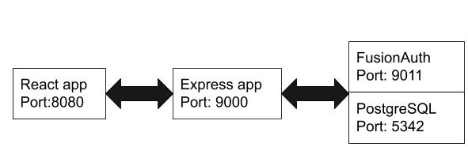
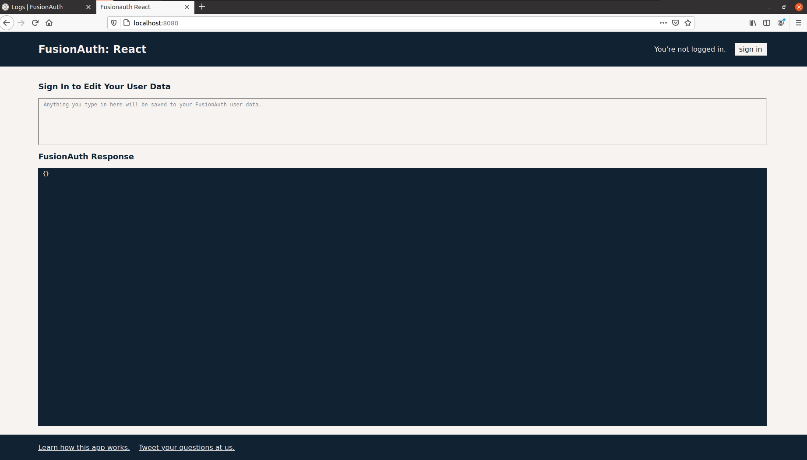
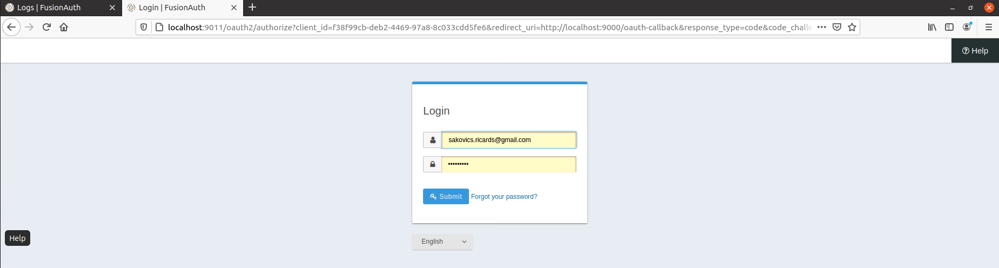
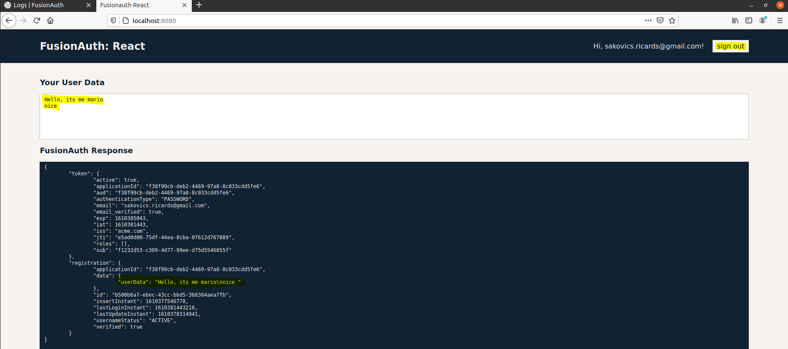
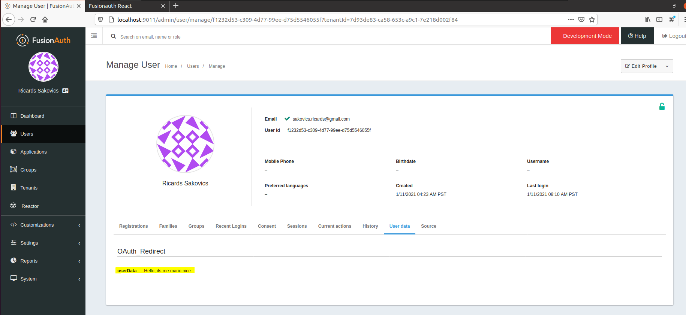
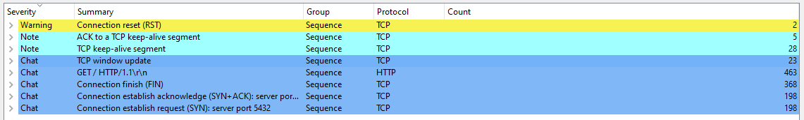
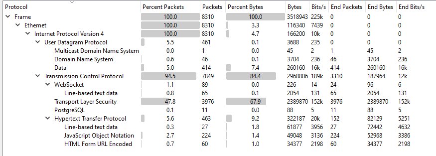
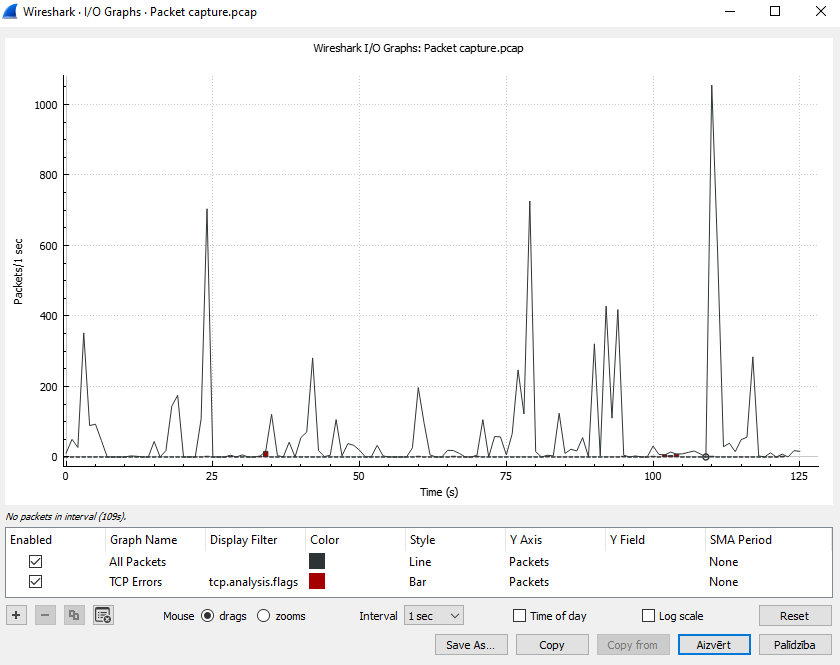
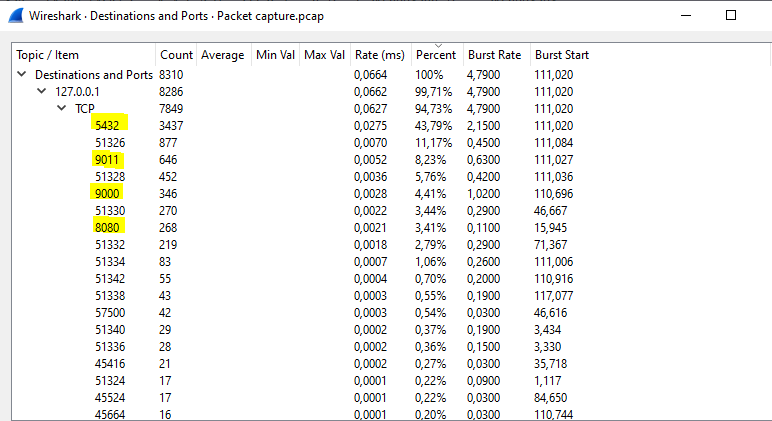

Mērķi:

1. Izveidot autentifikāciju mājas lapai, izmantojot FusionAuth
1. Ievietot informāciju/tekstu lietotāja kontā, kas tiek saglabāta un attēlota FusionAuth
1. Attēlot saglabāto informāciju vēlāk
1. Veikt pakešu analīzi starp front-end un back-end

Prasības lai palaistu projektu:

- React – lapas front endam
- NodeJS – lapas back-endam
- PostgreSQL – datu uzglabāšanai
- FusionAuth - autorizācijai

Darba palaišana:

1.	apt install nodejs
2.	apt install npm 
3.	apt-get install postgresql-12
4.	sh -c "curl -fsSL https://raw.githubusercontent.com/FusionAuth/fusionauth-install/master/install.sh | sh -s - -z" – fusionauth instalācija 
5.	Lejuplādēt failus no šī repository
6.	fusionauth/bin/startup.sh – fusionauth palaišana 
7.	http://localhost:9011 – fusionauth sākotnējā konifugurācija (savienošana ar postgresql un lietotāja izveide)
8.	http://localhost:9011 izveidot oAuth aplikāciju (Jāievada name, Authorized Redirect URL - http://localhost:9000/oauth-callback, LogOut URL - http://localhost:8080)
9.	FusionAuth admin panerlī zem Users, lietotājam pievineot registration Oauth
10.	Lejpulādētajā git mapē jāizmaina config.js ClientID, Client Secre, Redirect URI, application ID (vienāds ar ClientID). 
11.	Palaist server pusi
12.	npm install
13.	npm start – palaist servera pusi
14.	Palaist client pusi
15.	npm install
16.	npm start – palaist klienta pusi 
17.	http://localhost:8080/ - gala rezultāts

Shēma:

Kad lietotajs vaic autorizāciju react pusē, lietotājs tiek aizsūtīts uz express aplikāciju login, kas tiek veikts drošības nolūkos. Kad ielogošanās ir veiksmīga express pusē, tiek nosūtīts autorizācijas kods ar klienta ID FusionAuth serverim. Fusion serrveris pārbauda visus datus, un atibldē nosūta piekļuves (Access) tokenu. Express aplikācija šo tokenu sesijas atmiņā un atgriež lietotāju react daļā. 

Pie veiksmīgas autorizācijas, lietotājs var labot registration.data.userData objektu, kas ir atbilstošam lietotājam. Kad teksts tiek ievadīts/labots pieprasījums tiek nosūtīts Express aplikācijai un tālak nosūta uz FusionAuth galapunktu. 

Shēma attēlotā PostgreSQL datubāze tika izmantota kā vieta uz kura atrodas FusionAtuh, kas tieši sazinās ar datubāzi, tādeļ tika attēlota kā viena kopa.  PostgreSQL klientu autentifikācijā nav tik tieša, taču tomēr pie pakešu ķeršanas šis ports tiek ķerts, lai veiktu analīzi.

Rezultāts

Sākuma ekrāns:

Autentifikācija:

Lieotātaja datu izmaiņa, saglabāšana un iziešona no profila:

Pierādījums ka dati saglabājās (no FusionAuth puses):

Pakešu analīze:

Pakešu analīzē tikai izmantota sekojoša wireshark programma:

Pakešu ķeršanas process:

1. Palaist wireshark pakešu ķeršanu uz localhost
1. Startēt FusionAuth
1. Startēt servera pusi
1. Startēt klienta pusi
1. Autorizēties neveiksmīgi – nepareiza parole vai epasts
1. Autorizēties veiksmīgi
1. Ievadīt/izlabot tekstu, kas tiks saglabāts
1. Atslēgties
1. Veiksmīgi autorizēties atkārtoti lai pārbaudītu ievadītos datus 7. punktā
1. Pārtraukt pakešu ķeršanu 

Sākotnējais plāns bija veikt pakešu analīzi izmantojot WEKA, taču Wireshark izveidotais CSV fails netiek korekti nolasīts WEKA. Izmēģināju dažādus risinājumus, failu formātus, bet WEKA joprojām tos neatver. Tomēr, github tika pievienots arī PCAP fails.

Maza analīze izmantojot Wireshark sniegtās iespējas:

Pakešu sadalījumā absolūti lielākā daļa no paketēm izmanto TCP protokolu (94.5 %). 

Detalizētāks protokolu apkopojums, norādot procentuālo izmantošanu, pakešu izmēru ātrumu u.c. parametrus 

Pakešu skaits sekundē, visā pakešu ķeršanas diapazonā:

Portu procentuālā izmantošana. Iezīmētie ir tie proti, kas tika izmantoti sistēmas izveidē. Vieslielākā aktivitāte ir bijusi uz PostgreSQL portu, ar 43% no visiem portiem, kurš visvairāk iegūtu no savienojuma veiktspējas uzlabošanas, dēļ sava lielā trafika. 

Izmantotie resursi:

<https://fusionauth.io/blog/2020/03/10/securely-implement-oauth-in-react/>

<https://github.com/FusionAuth/fusionauth-example-react>

<https://fusionauth.io/docs/v1/tech/5-minute-setup-guide/>

<https://www.digitalocean.com/community/tutorials/how-to-install-and-use-postgresql-on-ubuntu-18-04>

<https://www.digitalocean.com/community/tutorials/how-to-install-node-js-on-ubuntu-18-04>
